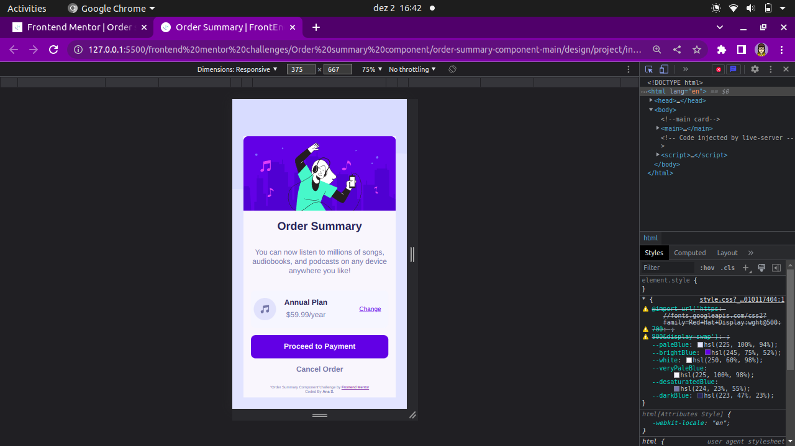
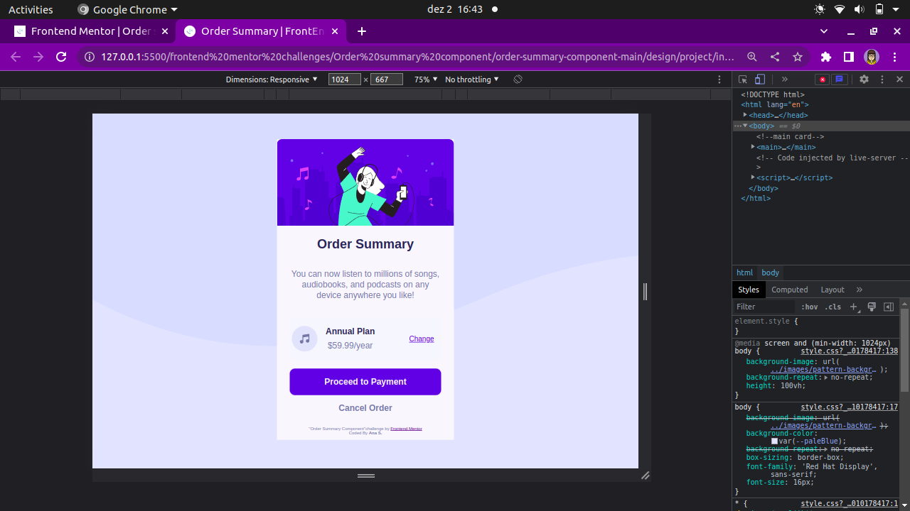

# Frontend Mentor - Order summary card solution

This is a solution to the [Order summary card challenge on Frontend Mentor](https://www.frontendmentor.io/challenges/order-summary-component-QlPmajDUj). Frontend Mentor challenges help you improve your coding skills by building realistic projects. 

## Table of contents

- [Overview](#overview)
  - [The challenge](#the-challenge)
  - [Screenshot](#screenshot)
  - [Links](#links)
- [My process](#my-process)
  - [Built with](#built-with)
  - [What I learned](#what-i-learned)
  - [Continued development](#continued-development)
  - [Useful resources](#useful-resources)
- [Author](#author)
- [Acknowledgments](#acknowledgments)

## Overview

### The challenge

Users should be able to:

- See hover states for interactive elements

### Screenshot

### Design Mobile

### Design Desktop

### Links

- Solution URL: [Add solution URL here](https://your-solution-url.com)
- Live Site URL: [Add live site URL here](https://your-live-site-url.com)

## My process

### Built with

- Semantic HTML5 markup
- CSS custom properties
- Flexbox
- CSS Grid
- Mobile-first workflow

### What I learned

Media queries are extremely useful to adapt the project to different sizes. 
This project started with a desktop first approach, of course I struggle more to complete it effectively. But once I developed a mobile-first mentality, the improvement in the workflow was noticiable.

"display: flex" made the project way more responsible than it was before I explored all its potential. 

The use of variables to switch between shades of color made it incredibly easy and effecive. 

### Continued development

I aim to improve my HTML to make it more inclusive and more readable to other developers. 

### Useful resources

- [A Complete Guide to CSS Grid](hhttps://css-tricks.com/snippets/css/complete-guide-grid/) - Memorizing all CSS commands can be overwhelming, so a little help made me solidify and expand my knowledge about grid and flexbox. 

## Author

- Github - [.ana](https://github.com/santos-ana-p)
- Frontend Mentor - [@hellomynameis-ana](https://www.frontendmentor.io/profile/hellomynameis-ana)

## Acknowledgments

I started this project as a single person but I believe that the internet is a community of amazing people sharing what they know. 
Thanks to several people on each corner of the internet, one comment at a time, we make it possible. 

